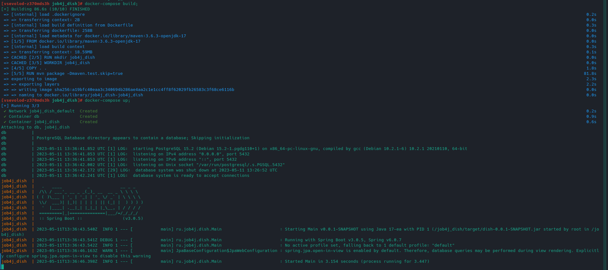
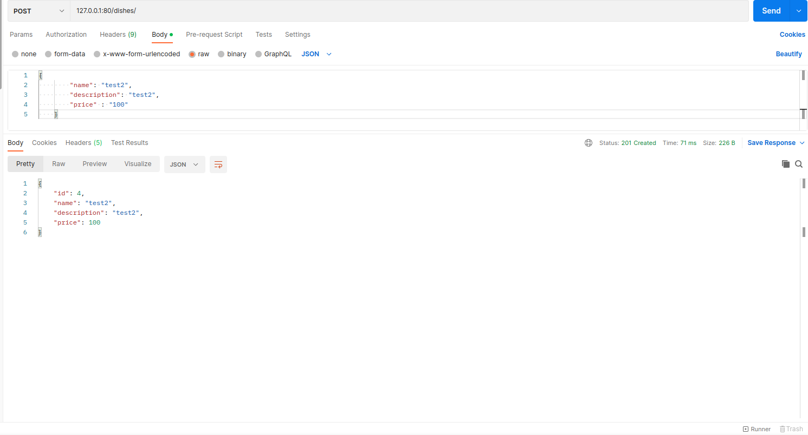
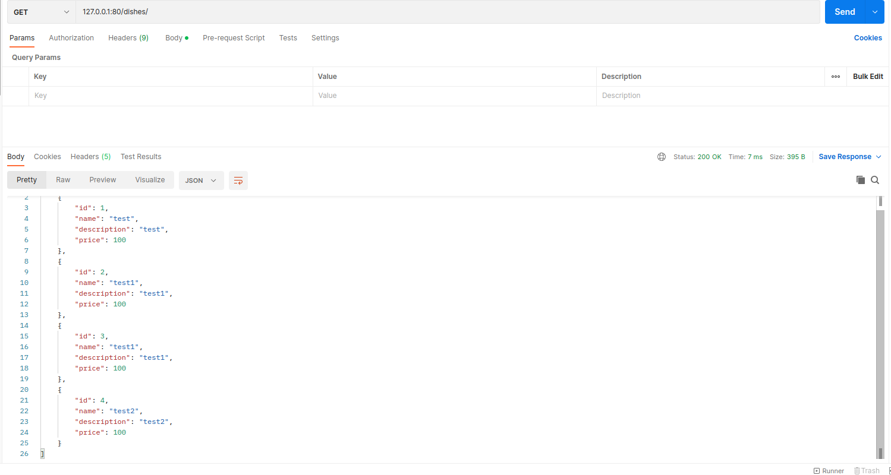

# job4j_dish

## Описание проекта.

Данный проект, созданный на REST принципах, является частью будущего учебного проекта для изучения микросервисной архитектуры. 
Заказ должен стать центральным звеном в сервисе доставки. 

## Стек.

- **Java 17**
- **Spring Boot 2.7.10**
- **Spring Data**
- **PostgreSQL 14**
- **Lombok**

## Требования.

- **Java 17**
- **Maven 3.8**
- **PostgresSQL 14**

## Запуск проекта.
Клонируем проект через git clone;
Переходим в папку проекта;
Вводим команду docker-compose build;
После завершения сборки вводим docker-compose up;

**Добавление блюда через Postman по адресу 127.0.0.1:80:8081** 

**Вывод всех блюд через Postman по адресу 127.0.0.1:80:8081**

